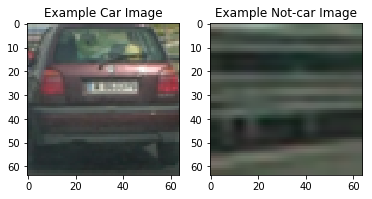
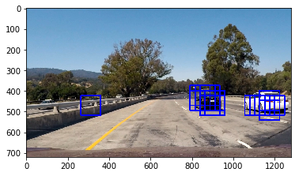
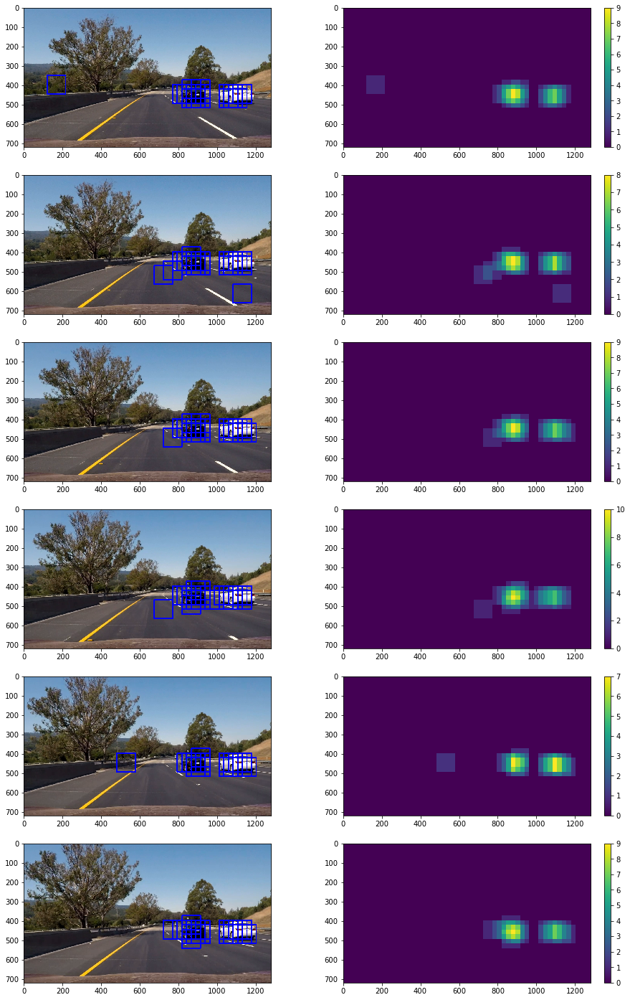
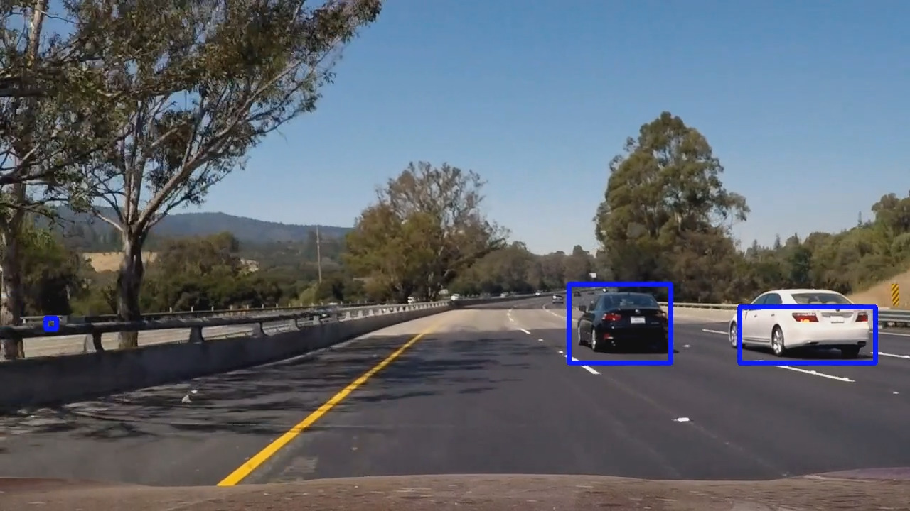
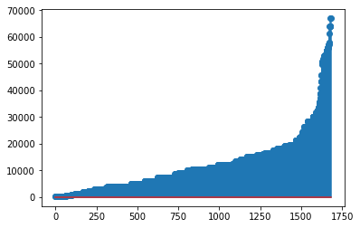
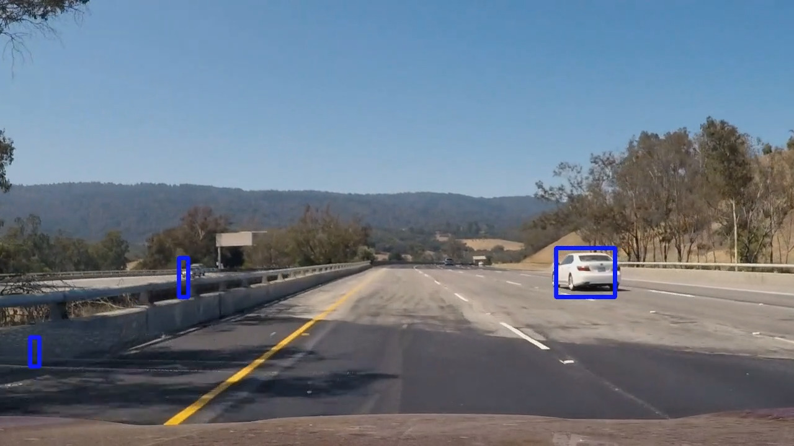
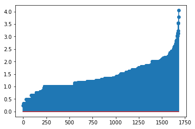
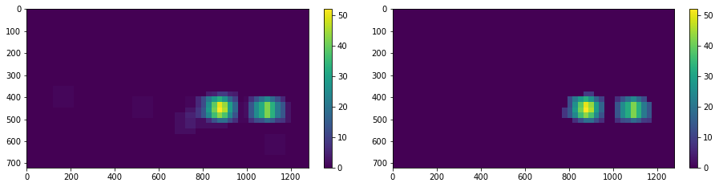

## Writeup Report


**Vehicle Detection Project**

The goals / steps of this project are the following:

* Perform a Histogram of Oriented Gradients (HOG) feature extraction on a labeled training set of images and train a classifier Linear SVM classifier
* Optionally, you can also apply a color transform and append binned color features, as well as histograms of color, to your HOG feature vector. 
* Note: for those first two steps don't forget to normalize your features and randomize a selection for training and testing.
* Implement a sliding-window technique and use your trained classifier to search for vehicles in images.
* Run your pipeline on a video stream (start with the test_video.mp4 and later implement on full project_video.mp4) and create a heat map of recurring detections frame by frame to reject outliers and follow detected vehicles.
* Estimate a bounding box for vehicles detected.


## [Rubric](https://review.udacity.com/#!/rubrics/513/view) Points
### Here I will consider the rubric points individually and describe how I addressed each point in my implementation.  

---
### Writeup / README

#### 1. Provide a Writeup / README that includes all the rubric points and how you addressed each one.  You can submit your writeup as markdown or pdf.  [Here](https://github.com/udacity/CarND-Vehicle-Detection/blob/master/writeup_template.md) is a template writeup for this project you can use as a guide and a starting point.  

You're reading it!

### Histogram of Oriented Gradients (HOG)

#### 1. Explain how (and identify where in your code) you extracted HOG features from the training images.

The code for this step appears in section **Exploring the dataset** in the notebook ``main.ipynb``

Before extracting HOG features, I decided to have a look at the dataset and print some statistics:

> Your dataset contains a count of 8792  cars and 8968  non-cars
of size:  (64, 64, 3)  and data type: uint8



Both classes are well balanced... but for this concrete application we need to reject a lot of false positives, so it would be better to apply data augmentation to the not-car class.

Later, in **"Perform a Histogram of Oriented Gradients (HOG) feature extraction.."** section, HOG features and color features are extracted.


#### 2. Explain how you settled on your final choice of HOG parameters.

Despite HOG features are very robuts, seemed to be a good idea to include color features. Cars can come in many different colors, but asphalt remains very similar all the time. Hence, I tried different combinations of the methods used in class.

This one seemed the most promising combination of parameters and features:

```python
colorspace = 'YCrCb'

# HOG
orient = 9
pix_per_cell = 8
cell_per_block = 2
hog_channel = 0 

# Color
spatial_size = (32, 32)
hist_bins = 32
```

I could include HOG features for all the channels, but seemed to me very redundant. In fact, I think the current feature vector of 4932 elements has already a lot of redundancy. I bet that carefully applying PCA will not harm the accuracy of the classifier but speed up training and testing time.


#### 3. Describe how (and identify where in your code) you trained a classifier using your selected HOG features (and color features if you used them).

In the same section as before, i.e. **"Perform a Histogram of Oriented Gradients (HOG) feature extraction.."**  in ``main.ipynb`` I trained a linear SVM classifier with a RBF kernel using the default parameters.

I tried with different combinations of parameters, tunning C and gamma, however, the default parameters returned the best accuracy:

* Test Accuracy of SVC =  0.9862
* Train Accuracy of SVC =  1.0

### Sliding Window Search

#### 1. Describe how (and identify where in your code) you implemented a sliding window search.  How did you decide what scales to search and how much to overlap windows?

In section **"Implement a sliding-window technique..."** after defining some parameters about the classifier, the ``find_cars()`` function defined in ``lesson_functions.py`` is called. 

Due to the characteristics of the image, I decided not to search for cars in the upper part of the image and in a small fraction at the botton corresponding with the hood of the car. This, together with the decision of analyzing the image in just one scale (1 factor, original size), resulted in a speedup of per-frame time processing.

Just analyzing one scale seems enough to find all the cars, using a properly overlap of 2 cells per step.



#### 2. Show some examples of test images to demonstrate how your pipeline is working.  What did you do to optimize the performance of your classifier?



Cars seemed to be well detected, however, many false positives appears, hence a filter needs to be applied. After having a look at the heatmap for each image seemed to be a good idea to filter out those detections that have a "heat" below a threshold. However, this step is performed later when dealing with the whole video, rather than frame-basis.

---

### Video Implementation

#### 1. Provide a link to your final video output.  Your pipeline should perform reasonably well on the entire project video (somewhat wobbly or unstable bounding boxes are ok as long as you are identifying the vehicles most of the time with minimal false positives.)

Here's a [link to my video result](https://youtu.be/DuU2Qejv9H0)


<a href="http://www.youtube.com/watch?feature=player_embedded&v=DuU2Qejv9H0
" target="_blank"></a>


#### 2. Describe how (and identify where in your code) you implemented some kind of filter for false positives and some method for combining overlapping bounding boxes.

The false positive filter is implemented in section **"Run your pipeline on a video stream.."** included in ``main.ipynb``. The strategy is as follows:

* We will keep a buffer_size images loaded in memory (for optimization purposes, only their detected bounding boxes are stored).
* A combined heatmap is computed for all the images in the buffer, and a threshold is applied to reject false positives. The resultant bounding boxes for the first frame in the buffer are stored in a list: ``video_bounding_boxes.append(frame_bounding_boxes)``
* A new frame is read that substitute the oldest one within the buffer.
* Goto step 1 until we reach total_ frames - buffer_ size.
* As the result of this algorithm is a list of detections (``video_bounding_boxes``) with a length shorter than the number of frames that compose the video(exactly buffer_size less), we need to find a way to overcome this. If the frame rate is high enough and the buffer size is small enough we can assume that the images will not be too different and we can copy the detections from the last available image to use them in the final frames.
* After this process, the video is read again from the beginning just to draw the cleaned detections stored in ``video_bounding_boxes`` list.

While this approach was very nice, there were still too much false positives (at least for my standards), so I implemented some post-processing filters: area filter and aspect ratio filter.

* Area filter: some of the false positives detected had a very small area, hence it was a good idea to remove those that were incompatible with car's size.





After some carefully analysis, those detection with an area below 400 pixels were rejected.

* Aspect ratio filter: some of the false positives detected had an aspect ratio clearly incompatible with the shape of any car. Those detections with an aspect ratio below or equal to 0.5 (height twice bigger than width) were rejected.






### Here are six frames and their corresponding heatmaps:


In this step, it was not applied any post-processing yet.

### Here is the resulting heatmap used for the first frame in the buffer:


This combined heatmap (on the left) is computed as a sum of all the heatmaps in the buffer plus a threshold equal to ``buffer_size`` (on the right). This way, non-overlapping detections, typically related with false positives are rejected. Also, each bounding box is smoothed across many frames, which leads to more stable detections.


---

### Discussion

#### 1. Briefly discuss any problems / issues you faced in your implementation of this project.  Where will your pipeline likely fail?  What could you do to make it more robust?

The biggest issue found in this project is related with execution time. The inference step is extremely slow to be applied in a self-driving car with real-time requirements. While HOG features are very nice, they are costly too. And the sliding-window approach is very inefficient. One possible solution would be porting the code to C++ instead of using Python. That solution, followed by some kind of region proposal system that only extract features in places where finding cars is plausible, will highly speed up the process. An asphalt detector could help for this. Other approaches may include trying recent Deep Learning techniques such as RCNN, Yolo or SSD.

Another problem found in this video is that it is "too easy" in terms of scale and perspective. A way to make this pipeline fail is to use other images where there is a heavier change in these aspects, like these ones from the [GRAM-RTM dataset](http://agamenon.tsc.uah.es/Personales/rlopez/data/rtm/):


As cars are moving away from the camera, it's size is decreasing and it's point of view is changing.
